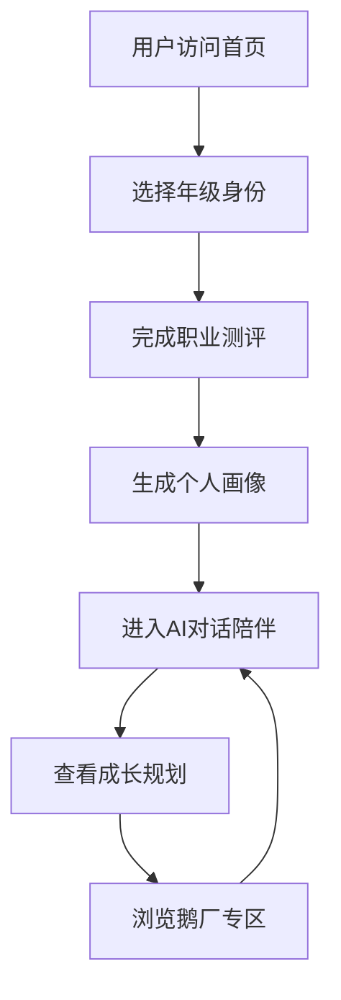

# 产品需求文档 - 未来鹅大学生职业成长AI陪伴平台

## 1. 产品概述
「未来鹅」是一款面向在校大学生（大一至研究生）的AI职业成长陪伴平台，通过智能化对话、个性化规划和精准资源推荐，为学生提供从入学到求职的全周期成长陪伴服务，帮助学生在每个阶段都能获得针对性的职业指导。

目标用户：在校大学生（大一、大二、大三、大四、研究生）
核心价值：将单向招聘转化为持续成长陪伴，建立早期连接与情感链接

## 2. 核心功能

### 2.1 用户角色
| 角色 | 使用场景 | 核心权限 |
|------|----------|----------|
| 大一新生 | 探索期 - 了解互联网行业和腾讯 | 行业认知、专业探索、兴趣发掘 |
| 大二学生 | 思考期 - 专业与职业关联 | 方向选择、技能规划、实践建议 |
| 大三学生 | 实习探索期 - 了解鹅厂岗位 | 实习推荐、简历优化、面试准备 |
| 大四学生 | 求职冲刺期 - 正式求职 | 秋招信息、offer对比、职场适应 |
| 研究生 | 深化期 - 高端岗位竞争 | 专业规划、学术转化、人脉拓展 |

### 2.2 功能模块
1. **首页**: 品牌展示、年级选择入口、AI对话快捷入口、核心功能导航
2. **个人画像页**: 职业测评问卷、画像可视化、成长档案
3. **AI对话页**: 智能陪伴对话、场景化功能切换（模拟面试/简历诊断/职业咨询）
4. **成长规划页**: 个性化成长路径、阶段性目标拆解、进度追踪
5. **鹅厂专区**: 腾讯岗位介绍、企业文化、培养体系、校招信息

### 2.3 页面详情
| 页面名称 | 模块名称 | 功能描述 |
|----------|----------|----------|
| 首页 | 品牌展示区 | 未来鹅品牌Logo、Slogan、视觉背景 |
| 首页 | 年级选择区 | 5个年级卡片，点击选择用户身份 |
| 首页 | 功能导航区 | AI对话、个人画像、成长规划、鹅厂专区入口 |
| 个人画像页 | 测评区 | 5道快速测评题（兴趣/性格/技能/目标/偏好） |
| 个人画像页 | 画像展示区 | 雷达图展示能力维度、职业方向推荐 |
| AI对话页 | 对话界面 | 消息列表、输入框、场景切换标签 |
| AI对话页 | 快捷功能区 | 简历诊断、模拟面试、职业咨询快捷按钮 |
| 成长规划页 | 路径展示 | 时间轴式成长路径、当前阶段高亮 |
| 成长规划页 | 资源推荐区 | 课程/证书/实习推荐卡片 |
| 鹅厂专区 | 岗位展示区 | 热门岗位分类、岗位要求简述 |
| 鹅厂专区 | 文化展示区 | 企业文化关键词、培养体系介绍 |

## 3. 核心流程
用户首次访问 → 选择年级 → 完成快速测评 → 生成个人画像 → 进入AI对话 → 查看成长规划 → 浏览鹅厂专区

## 4. 用户界面设计

### 4.1 设计风格
- **主色调**: 腾讯蓝 (#0052D9) + 活力橙 (#FF6B35) 作为品牌色
- **辅助色**: 深灰 (#1A1A2E) 用于文字、浅灰 (#F5F7FA) 用于背景
- **按钮风格**: 圆角按钮(12px)，带轻微阴影，hover时有缩放动画
- **字体**: 
  - 标题使用 "Noto Sans SC" 或 "PingFang SC" 体现现代感
  - 正文使用系统默认无衬线字体
  - 数字使用等宽字体增强科技感
- **布局**: 卡片式布局，顶部导航栏，响应式栅格系统
- **图标**: 使用线性图标配合微渐变背景

### 4.2 页面设计详情
| 页面名称 | 模块名称 | UI元素 |
|----------|----------|--------|
| 首页 | 品牌展示区 | 大标题动画进入、渐变背景、企鹅IP形象装饰 |
| 首页 | 年级选择区 | 5个悬停放大卡片、年级图标、简短描述 |
| AI对话页 | 对话界面 | 聊天气泡、打字指示器、消息时间戳、快捷回复 |
| 个人画像页 | 画像展示区 | 雷达图表、百分比进度条、标签云展示 |
| 成长规划页 | 路径展示 | 垂直时间轴、里程碑图标、完成状态指示器 |
| 鹅厂专区 | 岗位展示区 | 网格卡片布局、悬停详情展开、收藏图标 |

### 4.3 响应式设计
- 桌面端优先设计 (1440px基准)
- 平板自适应 (768px-1024px)
- 移动端优化 (< 768px)
