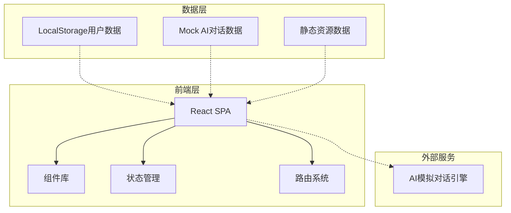

# 技术架构文档 - 未来鹅大学生职业成长AI陪伴平台

## 1. 架构设计


## 2. 技术说明
- **前端框架**: React@18 + TypeScript
- **构建工具**: Vite@5
- **样式方案**: TailwindCSS@3 + 自定义CSS
- **图表库**: Chart.js (用于雷达图)
- **图标库**: Lucide React
- **数据持久化**: LocalStorage (用户画像、对话历史)
- **后端**: 无（Demo使用Mock数据）
- **部署**: 静态文件托管

## 3. 路由定义
| 路由 | 用途 |
|------|------|
| / | 首页 - 品牌展示、年级选择、功能导航 |
| /profile | 个人画像页 - 职业测评、画像展示 |
| /chat | AI对话页 - 智能陪伴对话 |
| /growth | 成长规划页 - 路径展示、资源推荐 |
| /tencent | 鹅厂专区 - 岗位、文化、校招信息 |

## 4. 数据模型

### 4.1 用户画像数据
```typescript
interface UserProfile {
  grade: 'freshman' | 'sophomore' | 'junior' | 'senior' | 'graduate';
  interests: string[];
  skills: Record<string, number>;
  careerDirection: string[];
  goals: string[];
  assessmentScore: number;
}
```

### 4.2 AI对话数据
```typescript
interface ChatMessage {
  id: string;
  role: 'user' | 'assistant';
  content: string;
  timestamp: number;
  scene?: 'career' | 'interview' | 'resume';
}

interface ChatScene {
  id: string;
  name: string;
  icon: string;
  description: string;
  systemPrompt: string;
}
```

### 4.3 成长路径数据
```typescript
interface GrowthPath {
  grade: string;
  milestones: Milestone[];
  resources: Resource[];
}

interface Milestone {
  id: string;
  title: string;
  description: string;
  completed: boolean;
  deadline?: string;
}

interface Resource {
  id: string;
  type: 'course' | 'certificate' | 'internship' | 'article';
  title: string;
  description: string;
  url: string;
}
```

## 5. 核心组件结构
```
src/
├── components/
│   ├── Header.tsx              # 顶部导航
│   ├── GradeSelector.tsx       # 年级选择器
│   ├── ChatInterface.tsx       # 对话界面
│   ├── AssessmentForm.tsx      # 测评表单
│   ├── RadarChart.tsx          # 雷达图组件
│   ├── GrowthTimeline.tsx      # 成长时间轴
│   ├── ResourceCard.tsx        # 资源卡片
│   └── TencentSection.tsx      # 鹅厂专区
├── pages/
│   ├── Home.tsx                # 首页
│   ├── Profile.tsx             # 个人画像页
│   ├── Chat.tsx                # AI对话页
│   ├── Growth.tsx              # 成长规划页
│   └── Tencent.tsx             # 鹅厂专区
├── data/
│   ├── mockAI.ts               # Mock AI对话数据
│   ├── growthPaths.ts          # 成长路径数据
│   └── tencentInfo.ts          # 鹅厂信息数据
├── hooks/
│   ├── useChat.ts              # 对话逻辑
│   └── useProfile.ts           # 画像逻辑
└── types/
    └── index.ts                # 类型定义
```

## 6. AI模拟对话实现方案
由于是Demo环境，使用预设规则+关键词匹配的模拟AI对话：
- 根据用户年级返回对应阶段的建议
- 根据对话场景（职业咨询/模拟面试/简历诊断）切换回复策略
- 模拟打字效果，提供真实对话体验
- 支持快捷问题点击
